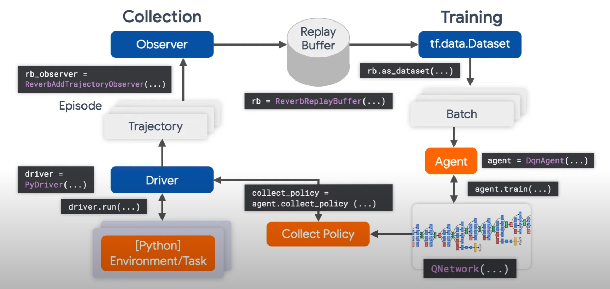

# 🚀 Projects perso

## 📈 Analyse des données AirBNB Paris [https://github.com/Biny17/PortfolioDash](https://github.com/Biny17/PortfolioDash)
[http://www.tristangallet.fr/](http://www.tristangallet.fr/) (veuillez attendre et actualiser)

Outils de Data Science utilisés: Plotly, Numpy, Pandas, Scipy
Outils pour le site internet: Dash, Html, Css, Heroku

## 🕹️ Une IA d'apprentissage par renforcement

### Google colab ici : [https://colab.research.google.com/drive/1EiBAV5swA9ykd-vKdSepUD9MZgUY4HKN?usp=sharing](https://colab.research.google.com/drive/1EiBAV5swA9ykd-vKdSepUD9MZgUY4HKN?usp=sharing)
### Utilisant Tensorflow Agent et Gym
L'agent utilise l'algorithme "Proximal Policy Optimization" sur l'environnement BattleZone, un jeu Atari.  
L'IA devra maneuvrer un tank et éliminer ses ennemies pour achever le meilleur score possible.

Renforcement Learning avec tf_agents:

## 🎮 Création d'un jeu mobile

#### Code C# sur github [https://github.com/Biny17/DragonWar_Code](https://github.com/Biny17/DragonWar_Code)
#### Première version disponible sur Itch.io [https://biny17.itch.io/dragon-war](https://biny17.itch.io/dragon-war)
