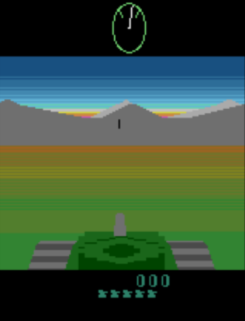

# 🚀 Projects perso

## 🎮 Création d'un jeu mobile

#### Code C# sur github [https://github.com/Biny17/DragonWar_Code](https://github.com/Biny17/DragonWar_Code)
#### Première version disponible sur Itch.io [https://biny17.itch.io/dragon-war](https://biny17.itch.io/dragon-war)

## 📈 Analyse des données AirBNB Paris [https://github.com/Biny17/PortfolioDash](https://github.com/Biny17/PortfolioDash)
Outils de Data Science utilisés: Plotly, Numpy, Pandas, Scipy
Outils pour le site internet: Dash, Html, Css, Heroku

## 🕹️ Reinforcement Learning AI plays BattleZone

### Google colab here : [https://colab.research.google.com/drive/1EiBAV5swA9ykd-vKdSepUD9MZgUY4HKN?authuser=0#scrollTo=bdH-JKcH9WZ9](https://colab.research.google.com/drive/1EiBAV5swA9ykd-vKdSepUD9MZgUY4HKN?authuser=0#scrollTo=bdH-JKcH9WZ9)
### Using Tensorflow Agent and Gym
Using Proximal Policy Optimization algorithm on the Atari game Battlezone, the AI will try to maneuver a tank and shoot it's ennemies to reach the highest score.
Basic of Reinforcement learning:  

BattleZone:   

